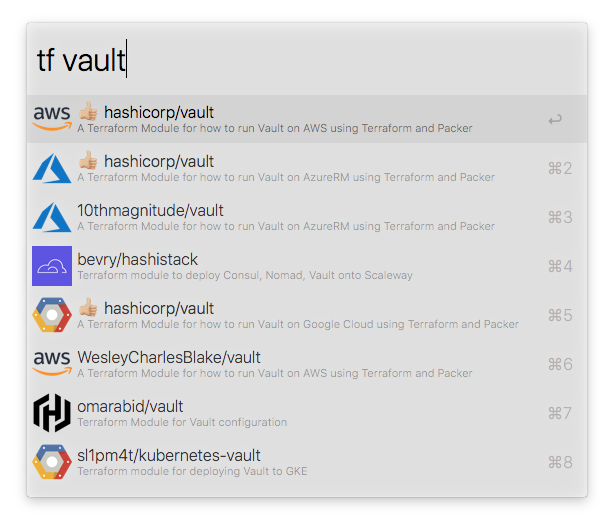

# terraform-registry.alfredworkflow

An Alfred PowerPack Workflow for searching the Terraform Registry for shared modules.

## Usage

For brevity, this workflow is triggered with `tf`.



Items preceded with the 👍🏼 emoji have been _verified_.

## Developing/Deploying

### Golang

Go (when spoken) or [Golang] (when written) is a strongly-typed language from Google that "blends the simplicity of Python with the performance of C". Static binaries can be compiled for all major platforms, and many minor ones.

It is recommended that you install Golang using your system's package manager. If you don't have one (or if the version is too old), you can [install Golang from its website](https://golang.org/doc/install). Reading the [Getting Started](https://golang.org/doc/) documentation is a valuable exercise.

```bash
brew update && brew install golang
```

### Glide

Golang dependencies are managed with [Glide]. You should install them before compiling this project.

```bash
curl https://glide.sh/get | sh
glide install
```

### GoMetaLinter

[GoMetaLinter] pulls together many popular linting tools, and can run them on a project.

```bash
gometalinter.v2 --install
```

### Developing

```bash
make build
bin/tfregistry "vault"
```

Make sure that you run the linter to catch any issues.

```bash
make lint
```

  [Glide]: https://glide.sh
  [Golang]: https://golang.org
  [GoMetaLinter]: https://github.com/alecthomas/gometalinter
