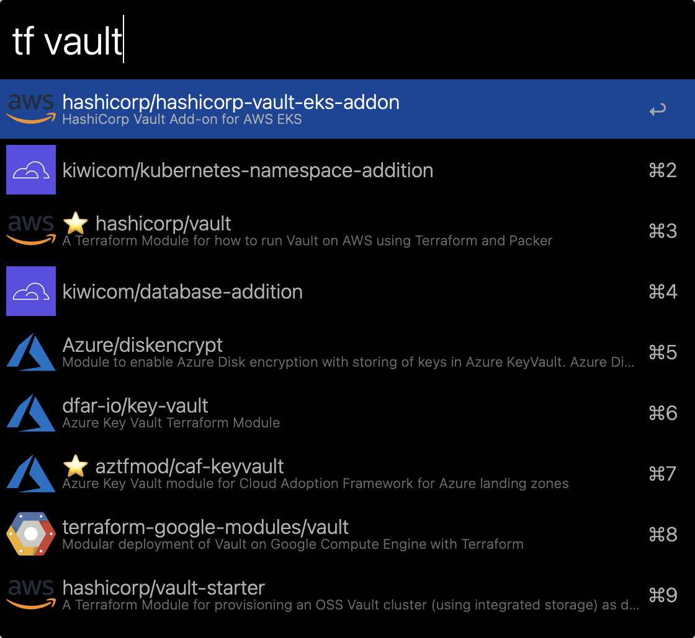

# terraform-registry.alfredworkflow

An Alfred PowerPack Workflow for searching the Terraform Registry for shared modules.

See [releases](https://github.com/skyzyx/terraform-registry.alfredworkflow/releases) to download!

## Usage

`tf {query}` — Search for a module.

Items preceded with the star emoji have been _verified_.

### Actions

* `↩` — Open the module in the Terraform Registry UI.
* `⌘↩` — Open the module’s source repository.
* `⇧/⌘Y` — Quicklook details

### Screenshots





Requires [Alfred and the PowerPack](https://www.alfredapp.com/powerpack/).

## Developing/Deploying

### Developing

```bash
make build
bin/tfregistry "vault"
```

Make sure that you run the linter to catch any issues.

```bash
make lint
```
